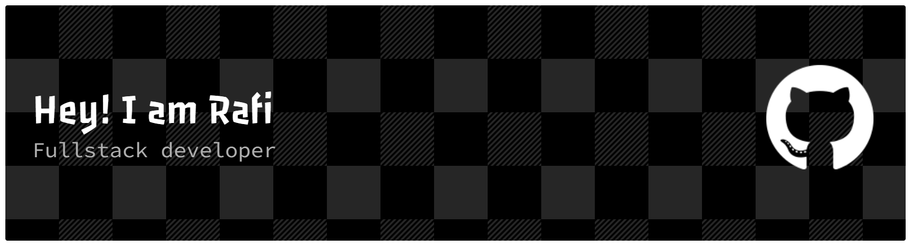

<div align="center">

# Muhammed Rafi

### Building AI Systems, Automation Infrastructure & Scalable Products


</div>

---

<table>
<tr>

<td width="50%">

### Current Focus

* AI Systems
* Business Automation
* SaaS Products
* Lead Generation Infrastructure
* Product Engineering

</td>

<td width="50%">

### Current Status

```text
Location  : Kerala, India

Building  : Vellmont

Mode      : Shipping

Focus     : AI + Automation

Status    : Active
```

</td>

</tr>
</table>

---

## Philosophy

```text
BUILD > TALK

SYSTEMS > EFFORT

EXECUTION > IDEAS

COMPOUNDING > INTENSITY

AUTOMATION > REPETITION
```

---

## System Architecture

```text
                 Vision
                    │
                    ▼

             AI Systems
                    │

      ┌─────────────┼─────────────┐
      │             │             │

      ▼             ▼             ▼

 Automation      SaaS         Products

      │             │             │

      └───────┬─────┴─────┬───────┘
              │           │

              ▼           ▼

       Business Ops   Revenue Systems
```

---

## Technology Stack

<p align="center">


</p>

---

## GitHub Analytics

<p align="center">


</p>

<p align="center">


</p>

---

## Active Research

```text
[01] Multi-Agent Systems

[02] AI Workflow Automation

[03] Business Intelligence Systems

[04] Lead Generation Infrastructure

[05] Scalable SaaS Architectures
```

---

## Timeline

```text
2022 ─ Learning

2023 ─ Freelancing

2024 ─ Product Building

2025 ─ Automation

2026 ─ AI Systems

2030 ─ ?
```

---

## Connect

<p align="center">

<a href="https://vellmont.online">
Website
</a>
•
<a href="mailto:mohammadrafi1291@gmail.com">
Email
</a>
•
<a href="https://www.linkedin.com/in/muhemmed-rafi-kc-216850359">
LinkedIn
</a>

</p>

---

<p align="center">


</p>

---

<div align="center">

### Building systems that continue working when I'm offline.

</div>
